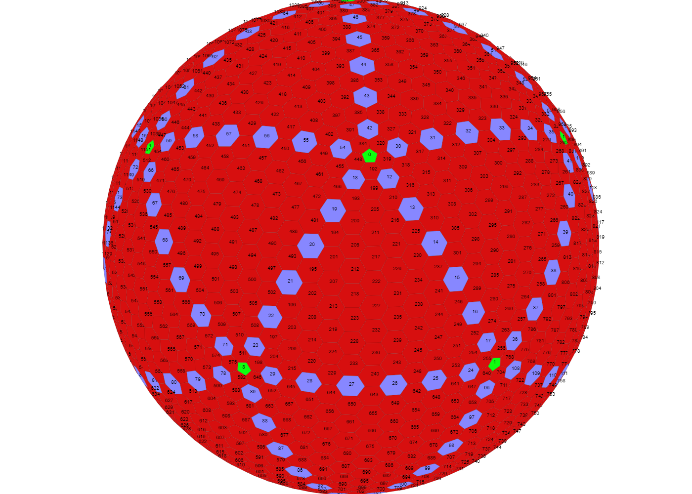
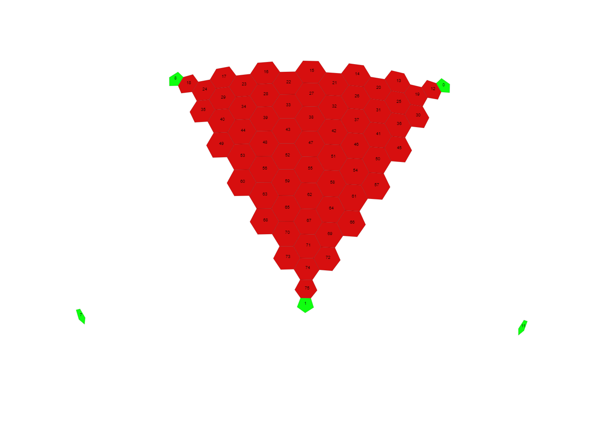

#Tile numbering

This is a picture of my rendering of Madis Moon 1

##Pentagons
0-11 are the 12 pentagons placed around the planet in the picture marked as green

| TileId | Neighbours |
|--------|------------|
| 0      | 1,4,5,8,11 |
| 1      | 0,6,7,8,11 |
| 2      | 3,6,7,9,10 |
| 3      | 2,4,5,9,10 |
| 4      | 0,3,5,8,9 |
| 5      | 0,3,4,10,11 |
| 6      | 1,2,7,10,11 |
| 7      | 1,2,6,8,9 |
| 8      | 0,1,4,7,9 |
| 9      | 2,3,4,7,8 |
| 10     | 2,3,5,6,11 |
| 11     | 0,1,5,6,10 |

##Connecting lines
next are the cells that connect the pentagons, in the picture marked as blue, they are numbered in following order and direction

| Direction Pentagon -> Pentagon | Tile numbers on Madis Moon 1 |
|--------|---------|
| 0->1   | 12-17   |
| 0->8   | 18-23   |
| 1->8   | 24-29   |
| 0->11  | 30-35   |
| 1->11  | 36-41   |
| 0->5   | 42-47   |
| 5->11  | 48-53   |
| 0->4   | 54-59   |
| 4->5   | 60-65   |
| 4->8   | 66-71   |
| 4->9   | 72-77   |
| 8->9   | 78-83   |
| 7->8   | 84-89   |
| 7->9   | 90-95   |
| 1->7   | 96-101  |
| 6->7   | 102-107 |
| 1->6   | 108-113 |
| 6->11  | 114-119 |
| 10-11  | 120-125 |
| 6->10  | 126-131 |
| 5->10  | 132-137 |
| 3->5   | 138-143 |
| 3->10  | 144-149 |
| 3->4   | 150-155 |
| 3->9   | 156-161 |
| 2->3   | 162-167 |
| 2->9   | 168-173 |
| 2->7   | 174-179 |
| 2->6   | 180-185 |
| 2->10  | 186-191 |

Between those lines connecting the pentagons there are triangles of thexagon cells that are numbered next

| Pentagon triangle corners | Numbering direcion |Tile numbers on Madis Moon 1 |
|-------------|-----------|-------|
| 0,4,5   | 0 -> 5   | 384-447 |
| 0,4,8   | 0 -> 4   | 448-511
| 4,8,9   | 4 -> 9   | 512-575
| 7,8,9   | 7 -> 8   | 576-639
| 1,7,8   | 1 -> 8   | 640-703
| 1,6,7   | 1 -> 7   | 704-767
| 1,6,11  | 1 -> 6   | 768-831
| 6,10,11 | 6 -> 10  | 832-895
| 5,10,11 | 10 -> 5  | 896-959
| 3,5,10  | 3 -> 5   | 960-1023
| 3,4,5   | 3 -> 4   | 1024-1087
| 3,4,9   | 3 -> 9   | 1088-1151
| 2,3,9   | 2 -> 9   | 1152-1215
| 2,7,9   | 2 -> 7   | 1216-1279
| 2,6,7   | 2 -> 6   | 1280-1343
| 2,6,10  | 2 -> 10  | 1344-1407
| 2,3,10  | 2 -> 3   | 1408-1471
